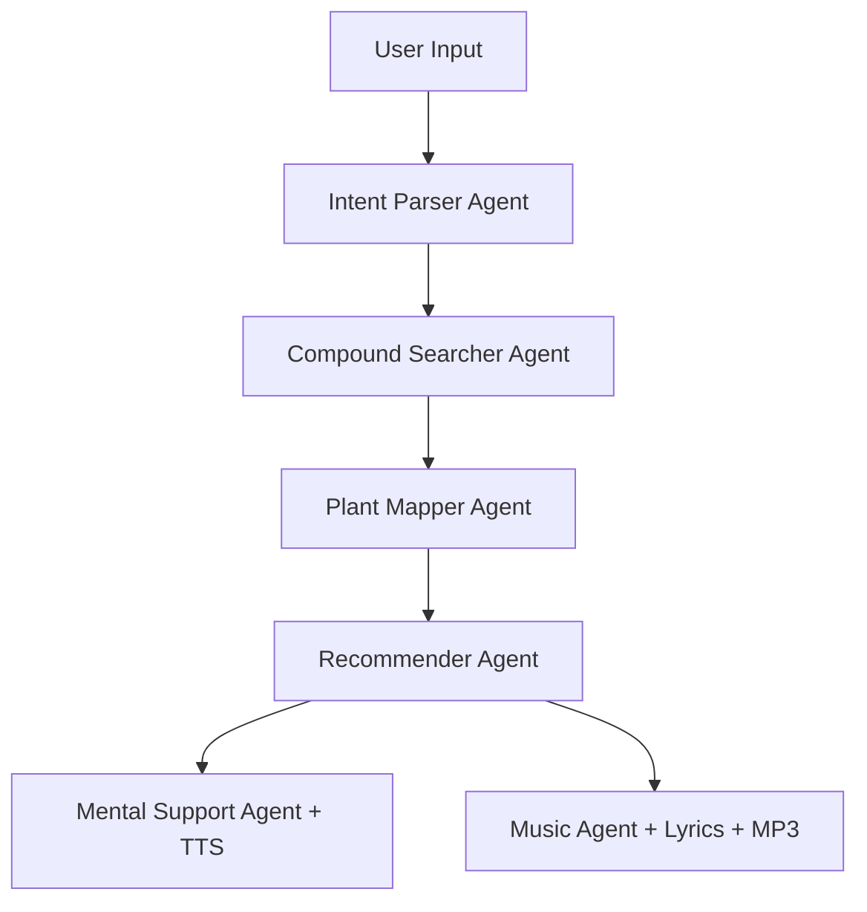

# Aroma Agents: Multi-Stage Emotional Support System

**Aroma Agents** is a multi-agent emotional wellness pipeline powered by large language models and the [Google Agent Development Kit (ADK)](https://github.com/google/adk-python). The system interprets user input to detect emotional context and delivers personalized aroma suggestions, herbal mappings, music generation, and gentle voice-based support.

This project demonstrates how to build an **LLM-powered agent chain** for enhancing emotional well-being using structured ADK pipelines and real-world generative APIs.

---

## 🧠 Key Use Case

> “I’ve been feeling anxious lately due to exams and want something to help me relax.”

The Aroma Agent processes this request to:

1. Understand the user’s emotional context.
2. Recommend aroma compounds that are known to help.
3. Map them to real herbs or plant products.
4. Suggest how to use them (e.g., tea, diffuser).
5. Compose a short encouraging message with synthesized voice output.
6. Generate a soft musical track with healing vibes.

---

## 🧱 Agent Pipeline



Each agent is modular and communicates via structured inputs and outputs defined with Pydantic.

---
## Architecture


---

## 🔧 Project Structure

```
Aroma_Agents_ADK_project/
├── agent.py                    # Top-level SequentialAgent pipeline
├── .env                        # API keys and environment config
├── sub_agents/
│   ├── intent_parser/          # Detects emotion, context, preferences
│   ├── compound_searcher/      # Suggests matching aroma compounds
│   ├── plant_mapper/           # Maps compounds to herbs/plants
│   ├── recommender/            # Suggests use cases and explanations
│   ├── mental_support/         # Offers a kind message + audio
│   └── music/                  # Generates lyrics and music via Suno API
├── tools/
│   ├── tts_tool.py             # TTS tool using Gemini 1.5 Pro
│   └── music_tool.py           # Music generation via Suno API
├── utils/
│   ├── config.py               # Model configs and API keys
│   └── gemini_tts_generator.py # Gemini-based audio output engine
└── README.md
```

---

## 🛠️ Setup

### 1. Install dependencies

```bash
pip install -r requirements.txt
# or
poetry install
```

### 2. Set up `.env` file

Create a `.env` file in the project root:

```env
GOOGLE_API_KEY=XXXXXXXXXXX
SUNO_API_KEY=YYYYYYYY
GOOGLE_GENAI_USE_VERTEXAI=FALSE
```

These keys allow access to:

* [Google Gemini API](https://ai.google.dev/)
* [Suno API](https://sunoapi.org/) for music generation

### 3. Run the Agent

```bash
adk run Aroma_Agents
```

This will launch the `SequentialAgent` defined in `agent.py`.

---

## 🧩 Agent Details

### Intent Parser Agent

Extracts:

* `mood` (e.g., anxious, tired)
* `context` (e.g., work, study, social)
* `preferences` (e.g., tea, diffuser, music)

> Powered by: `gemini-2.0-flash`

---

### Compound Searcher Agent

Recommends aroma compounds such as `linalool`, `citronellal`, `menthol`.

> Prompt and reasoning are model-driven based on emotional context.

---

### Plant Mapper Agent

Maps compounds to real plants and parts used (e.g., lavender flower, peppermint leaf).

---

### Recommender Agent

Outputs:

* Suggested use: tea, inhaler, diffuser, massage
* Explanation: therapeutic context and scent profile

---

### Mental Support Agent + TTS

Generates a brief kind message like:

> "You’re doing your best. Remember to breathe and be gentle with yourself."

Then converts this to audio using Gemini TTS (`gemini-2.5-flash-preview-tts`) via:

```python
GeminiTTSGenerator.generate_audio()
```

---

### Music Agent + MP3

* Generates lyrics using Gemini
* Submits request to Suno API
* Polls status
* Downloads and saves `.mp3` file locally

Output file is saved to `/music_outputs/`.

---

## 🧪 Sample Output

```
C:\work\Aroma_Agents_ADK_project> adk run Aroma_Agents
Log setup complete: C:\Users\galle\AppData\Local\Temp\agents_log\agent.20250618_103956.log
To access latest log: tail -F C:\Users\galle\AppData\Local\Temp\agents_log\agent.latest.log
Running agent Aroma_Agents, type exit to exit.
[user]: I just failed my final exam and I feel completely overwhelmed. My chest feels tight, and I can't stop crying. I wish there was something—music, a scent, anything—that could help me calm down and feel okay again.
[intent_parser_agent]: {
  "mood": "overwhelmed",
  "context": "failed final exam",
  "preferences": "music, scent to calm down"
}
[compound_searcher_agent]: {
  "compound_candidates": [
    "Linalool",
    "Limonene",
    "alpha-Pinene",
    "Bergamot",
    "Geraniol"
  ]
}
[plant_mapper_agent]: {
  "matching_plants_or_products": [
    {
      "plant_name": "Lavender",
      "part_used": "Flowering tops",
      "additional_info": "Lavender is known for its calming properties due to linalool, which helps reduce anxiety and promote relaxation."
    },
    {
      "plant_name": "Lemon",
      "part_used": "Fruit peel",
      "additional_info": "Lemon contains limonene, which is known for its mood-boosting and stress-reducing effects."
    },
    {
      "plant_name": "Rose",
      "part_used": "Flowers",
      "additional_info": "Rose contains geraniol, which may help to reduce stress and promote emotional well-being."
    },
    {
      "plant_name": "Bergamot Orange",
      "part_used": "Fruit peel",
      "additional_info": "Bergamot essential oil is extracted from the peel of bergamot oranges and is commonly used to alleviate stress and anxiety."
    },
    {
      "plant_name": "Pine",
      "part_used": "Needles",
      "additional_info": "Pine needles contain alpha-Pinene, which has been shown to reduce anxiety and improve mood."
    }
  ]
}
[recommender_agent]: {
  "recommended_use": "I'm so sorry to hear you're feeling overwhelmed after your exam. To help calm your nerves, I recommend using Lavender, Bergamot, or Lemon. Lavender contains linalool, which is great for relaxation; Bergamot is excellent for easing stress and anxiety; and Lemon has limonene, known for its mood-boosting effects. You could try adding a few drops of lavender or bergamot essential oil to a warm bath, or diffusing lemon oil in your room while you listen to calming music. Remember, it's okay to take time to care for yourself.",
  "scent_profile": "floral, citrusy, fresh",
  "explanation": "These plants contain compounds that can help reduce anxiety and improve mood."
}
[mental_support_agent]: Oh, sweetheart, I'm so sorry to hear you're going through this. Failing a final exam is incredibly tough, and it's completely understandable that you're feeling overwhelmed, with that tightness in your chest and the tears. Please know that you're not alone in feeling this way, and it's okay to cry and let those emotions out.

Take a deep breath, if you can. It's just one exam, and it doesn't define your worth or your future. It's a setback, yes, but setbacks are a part of life's journey. Think about Lavender, Bergamot, or Lemon; maybe imagining their scents could offer a tiny bit of comfort right now.  

For this moment, give yourself permission to just be. Be sad, be upset, but also be kind to yourself. You deserve kindness and compassion, especially now. We will figure things out.


✅ Saved audio to: audio_outputs\exam_failure_comfort_0.wav
Audio successfully generated and saved to audio_outputs\exam_failure_comfort_0.wav
[mental_support_agent]: I've created an audio file with that comforting message for you. I hope it helps, even just a little. Remember, I'm here to listen whenever you need.

[music_agent]: Okay, I will write a song for you. Here are the lyrics:

(Verse 1)
The weight of the world, it crashed on down,
A wave of despair in this lonely town.
The test is done, the results are in,
And a storm of emotions begins.

(Chorus)
But hold on, darling, don't lose your light,
There's still a star in the darkest night.
This moment's a whisper, it won't define,
The strength that's within, the future that's thine.

(Verse 2)
Feel the tightness, the tears that fall,
It's okay to stumble, it's part of it all.
Like lavender fields, breathe in so deep,
Let calmness surround you, secrets to keep.

(Chorus)
But hold on, darling, don't lose your light,
There's still a star in the darkest night.
This moment's a whisper, it won't define,
The strength that's within, the future that's thine.

(Bridge)
Like bergamot's scent, let worries fade,
A citrusy promise, a new serenade.
You're more than a grade, more than a test,
A spirit so bright, divinely blessed.

(Chorus)
But hold on, darling, don't lose your light,
There's still a star in the darkest night.
This moment's a whisper, it won't define,
The strength that's within, the future that's thine.

(Outro)
So breathe in the lemon, its zest so alive,
You're resilient, darling, you will survive.
The sun will rise, and you'll find your way,
Brighter and stronger, each and every day.


Orchestrator: Kicking off the music generation process for 'healing_song_for_user'...
🎵 Submitting music generation task for title: 'healing_song_for_user'...
✅ Task submitted successfully. Use this Task ID for status checks: def31c0ebb9fd55b8a842e81630d9907
Orchestrator: Waiting 2 seconds for the task to register on the server...
Orchestrator: Starting to poll for task def31c0ebb9fd55b8a842e81630d9907. This may take several minutes...
🕒 Checking status for Task ID: def31c0ebb9fd55b8a842e81630d9907...
⏳ Task def31c0ebb9fd55b8a842e81630d9907 is still processing. Current API status: 'PENDING'.
🕒 Checking status for Task ID: def31c0ebb9fd55b8a842e81630d9907...
⏳ Task def31c0ebb9fd55b8a842e81630d9907 is still processing. Current API status: 'PENDING'.
🕒 Checking status for Task ID: def31c0ebb9fd55b8a842e81630d9907...
⏳ Task def31c0ebb9fd55b8a842e81630d9907 is still processing. Current API status: 'PENDING'.
🕒 Checking status for Task ID: def31c0ebb9fd55b8a842e81630d9907...
⏳ Task def31c0ebb9fd55b8a842e81630d9907 is still processing. Current API status: 'PENDING'.
Orchestrator: Still waiting for music generation... (32 seconds elapsed)
🕒 Checking status for Task ID: def31c0ebb9fd55b8a842e81630d9907...
⏳ Task def31c0ebb9fd55b8a842e81630d9907 is still processing. Current API status: 'PENDING'.
🕒 Checking status for Task ID: def31c0ebb9fd55b8a842e81630d9907...
⏳ Task def31c0ebb9fd55b8a842e81630d9907 is still processing. Current API status: 'TEXT_SUCCESS'.
🕒 Checking status for Task ID: def31c0ebb9fd55b8a842e81630d9907...
⏳ Task def31c0ebb9fd55b8a842e81630d9907 is still processing. Current API status: 'TEXT_SUCCESS'.
Orchestrator: Still waiting for music generation... (62 seconds elapsed)
🕒 Checking status for Task ID: def31c0ebb9fd55b8a842e81630d9907...
⏳ Task def31c0ebb9fd55b8a842e81630d9907 is still processing. Current API status: 'TEXT_SUCCESS'.
🕒 Checking status for Task ID: def31c0ebb9fd55b8a842e81630d9907...
⏳ Task def31c0ebb9fd55b8a842e81630d9907 is still processing. Current API status: 'TEXT_SUCCESS'.
🕒 Checking status for Task ID: def31c0ebb9fd55b8a842e81630d9907...
⏳ Task def31c0ebb9fd55b8a842e81630d9907 is still processing. Current API status: 'TEXT_SUCCESS'.
Orchestrator: Still waiting for music generation... (92 seconds elapsed)
🕒 Checking status for Task ID: def31c0ebb9fd55b8a842e81630d9907...
⏳ Task def31c0ebb9fd55b8a842e81630d9907 is still processing. Current API status: 'TEXT_SUCCESS'.
🕒 Checking status for Task ID: def31c0ebb9fd55b8a842e81630d9907...
⏳ Task def31c0ebb9fd55b8a842e81630d9907 is still processing. Current API status: 'TEXT_SUCCESS'.
🕒 Checking status for Task ID: def31c0ebb9fd55b8a842e81630d9907...
⏳ Task def31c0ebb9fd55b8a842e81630d9907 is still processing. Current API status: 'TEXT_SUCCESS'.
Orchestrator: Still waiting for music generation... (122 seconds elapsed)
🕒 Checking status for Task ID: def31c0ebb9fd55b8a842e81630d9907...
⏳ Task def31c0ebb9fd55b8a842e81630d9907 is still processing. Current API status: 'FIRST_SUCCESS'.
🕒 Checking status for Task ID: def31c0ebb9fd55b8a842e81630d9907...
⏳ Task def31c0ebb9fd55b8a842e81630d9907 is still processing. Current API status: 'FIRST_SUCCESS'.
🕒 Checking status for Task ID: def31c0ebb9fd55b8a842e81630d9907...
✅ Task def31c0ebb9fd55b8a842e81630d9907 is completed. Found 2 audio file(s).
⬇️ Starting download of 2 file(s)...
🔗 Downloading 'healing_song_for_user_1.mp3' from: https://apiboxfiles.erweima.ai/NzVjMTY5NDMtMWRkNS00MGQxLTkwMWYtNWY2OTB...
✅ Music saved to: music_outputs\healing_song_for_user_1.mp3
🔗 Downloading 'healing_song_for_user_2.mp3' from: https://apiboxfiles.erweima.ai/N2RiY2NiNWYtOWYwYi00MzZkLTgwZmYtM2I4NWI...
✅ Music saved to: music_outputs\healing_song_for_user_2.mp3

🎉 Download task finished!
Orchestrator: Successfully generated and saved 2 song(s). Paths: music_outputs\healing_song_for_user_1.mp3, music_outputs\healing_song_for_user_2.mp3
[music_agent]: I have created the song and it has been saved. I hope it helps you feel better.
```

---

## 📚 Requirements

* `google-adk >= 1.0.0`
* `google-generativeai >= 0.3.2`
* `pydantic >= 2.10`
* `python-dotenv`
* `requests >= 2.31.0`

---

## 🙌 Acknowledgments

Built using [Google ADK](https://github.com/google/adk-python) and inspired by:

* [`llm-auditor`](https://github.com/google/adk-samples/tree/main/python/agents/llm-auditor)
* [`auto-insurance-agent`](https://github.com/google/adk-samples/tree/main/python/agents/auto-insurance-agent)

Music generation powered by [Suno API](https://sunoapi.org/). TTS by [gemini-2.5-flash-preview-tts](https://ai.google.dev/).
